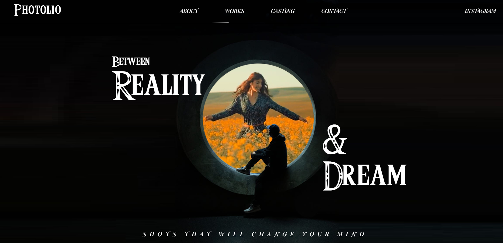

# Photolio

  

## Description

  A photography portfolio using GSAP's scrolltrigger. A fun and beautifully animated website for an aspiring photographer. Check it out [here](https://j-sniff.github.io/photolio/)

## Table of Contents

- [Installation](#installation)
- [Usage](#usage)
- [Contributing](#contributing)
- [Tests](#tests)
- [License](#license)
- [Questions](#questions)

## Installation

  n/a

## Usage

  Watch magic happen as you scroll through the application. 
  

## Contributing

  n/a

## Tests

  n/a
  
## License

This project is licensed under the terms of the [MIT license](https://opensource.org/licenses/MIT).
    

## Questions

  If you have any questions, concerns, or comments please reachout to me on [Github](https://github.com/J-Sniff or at jacobsniff18@gmail.com).
